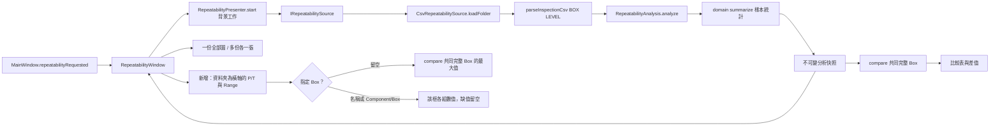

# 靜態重複性的資料流

## 修改紀錄

| 日期 | 修改者 | 說明 |
|---|---|---|
| 2026-10-16 | Codex (GPT-6.1-sol) | 記錄修改前與修改後流程 |

## 修改前

```mermaid
flowchart LR
  CSV[檢測 CSV] --> VBA[Module1.importCSV2]
  VBA --> Sheet[每指標一張工作表]
  Sheet --> Formula[STDEV / Range / P/T]
  Formula --> Chart[RedrawChart 固定指標清單]
```

## 修改後

```mermaid
flowchart LR
  Entry[MainWindow.repeatabilityRequested] --> View[RepeatabilityWindow]
  View --> Worker[RepeatabilityPresenter.start 背景工作]
  Worker --> Port[IRepeatabilitySource]
  Port --> CSV[CsvRepeatabilitySource.loadFolder]
  CSV --> Parse[parseInspectionCsv BOX LEVEL]
  Parse --> Analysis[RepeatabilityAnalysis.analyze]
  Analysis --> Stats[domain summarize 樣本統計]
  Stats --> Snapshot[不可變分析快照]
  Snapshot --> View
  View --> Plots[一份全部圖 / 多份各一張]
  Snapshot --> Compare[compare 共同完整 Box]
  Compare --> Table[比較表與差值]
  View --> Lines[新增：資料夾為橫軸的 P/T 與 Range]
  Lines --> Filter{指定 Box？}
  Filter -->|留空| Summary[compare 共同完整 Box 的最大值]
  Filter -->|名稱或 Component/Box| Box[該框各組數值，缺值留空]
```
